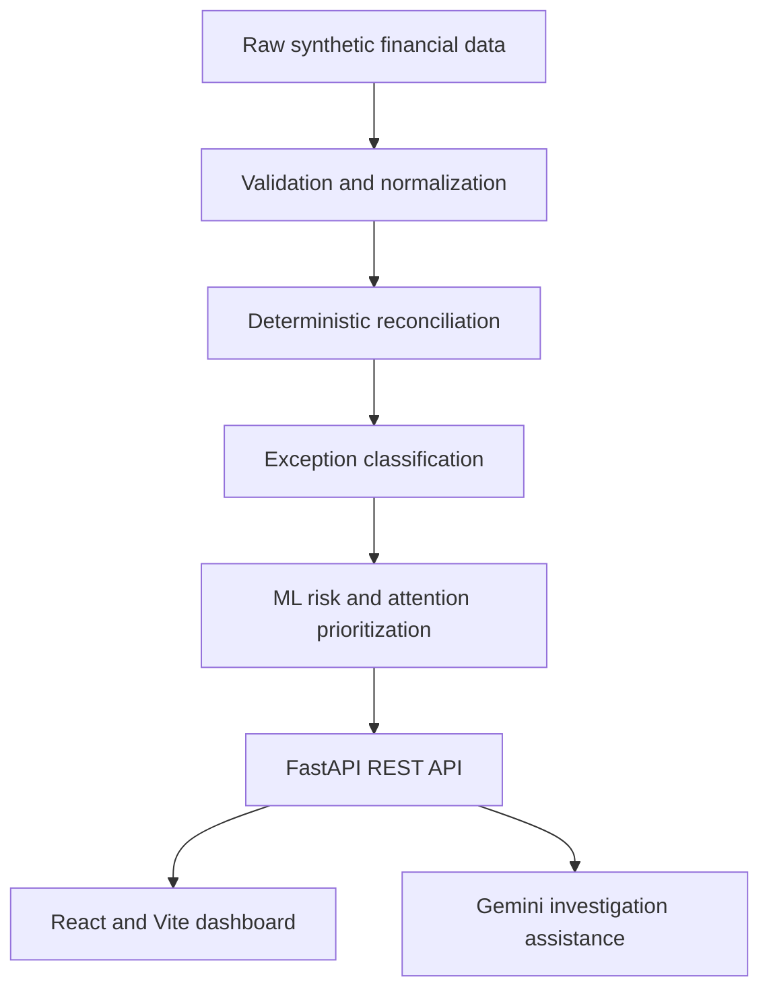

# LedgerLine

**AI-powered finance operations platform for transaction reconciliation, exception management, ML risk prioritization, and evidence-grounded investigation.**

## Why It Matters

Finance teams reconcile bank transactions, payment gateway records, invoices, and ledger entries across systems with different references, dates, and statuses. LedgerLine turns that manual work into an auditable workflow for finding exceptions, prioritizing attention, and investigating supplied evidence.

## What It Does

1. Loads synthetic financial source records.
2. Validates and normalizes inputs.
3. Performs deterministic reconciliation.
4. Classifies operational exceptions.
5. Prioritizes attention with an interpretable ML risk layer.
6. Serves results through FastAPI.
7. Presents an operations control center in React.
8. Uses Gemini to explain existing transaction evidence when configured.

> **Deterministic engine decides what happened -> ML prioritizes attention -> Gemini helps explain why -> a human makes the operational decision.**

## Architecture



## Business Value

| Capability                   | Business value                               |
| ---------------------------- | -------------------------------------------- |
| Deterministic reconciliation | Reliable, auditable financial decisioning    |
| Exception classification     | Faster and more consistent investigation     |
| ML risk prioritization       | Analysts focus on high-attention cases first |
| Risk factors                 | More transparent prioritization              |
| Gemini investigation         | Faster evidence-based analysis               |
| Operations dashboard         | One control center for review work           |

## Reconciliation

The deterministic engine checks transaction identity, references, amounts, dates, payment status, ledger consistency, and duplicate conditions. Current outcomes include `MATCHED`, `DATE_MISMATCH`, `DUPLICATE_PAYMENT`, `AMOUNT_MISMATCH`, `LEDGER_EXCEPTION`, `PAYMENT_FAILED`, and `PAYMENT_REFUNDED`.

Deterministic reconciliation is the source of truth. ML and Gemini never replace `final_status` or the existing recommended action.

## ML Risk Layer

ML prioritizes operational attention; it does not determine reconciliation truth. The selected model is Logistic Regression. Risk probability, unified risk score, risk level, and top risk factors are surfaced to analysts. Identity, deterministic outcome, and evaluation-only fields are excluded from training features.

The current `high_attention` target is derived from reconciliation rules and is trained on 500 synthetic records. Evaluation is therefore a pipeline sanity check, not evidence of production predictive performance. A production model should eventually learn from historical analyst outcomes such as review, escalation, confirmed resolution, SLA breach, or financial loss.

## Gemini Investigation

Gemini acts as an investigation assistant, not the financial source of truth. The server sends only structured transaction evidence already available from the API. Responses are schema-validated, provider provenance is shown in the dashboard, and a deterministic evidence-based fallback supports local demos when Gemini is unavailable.

Configure credentials in a local `.env` file using `.env.example`. The key is server-side only and is never exposed to the React frontend.

## Dashboard

The React operations control center includes KPI overview, exception and risk distribution, settlement-delay analysis, priority action queue, transaction explorer, transaction detail drawer, ML risk intelligence, and Gemini investigation provenance.

## Tech Stack

| Layer    | Technology      | Why                                          |
| -------- | --------------- | -------------------------------------------- |
| Frontend | React + Vite    | Fast, component-based dashboard              |
| Styling  | CSS             | Lightweight responsive enterprise UI         |
| Backend  | FastAPI         | Typed REST endpoints and validation          |
| Language | Python          | Data processing, ML, API, and AI integration |
| Data     | Pandas + CSV    | Transparent, reproducible data pipeline      |
| ML       | scikit-learn    | Interpretable modeling and evaluation        |
| AI       | Google Gemini   | Evidence-grounded investigation assistance   |
| Testing  | Pytest + Vitest | Backend and frontend regression coverage     |
| API      | REST + JSON     | Clear frontend/backend separation            |

## Dataset and Artifacts

The repository includes a synthetic 500-transaction dataset created for demonstration and reproducibility. Raw sources are in `data/raw/`; processed application outputs are in `data/processed/`. Evaluation ground truth is kept separate and ignored because it is not required for application execution.

The small trained artifacts in `models/` are included so inference can run without retraining: `risk_model.joblib`, `risk_model_metadata.json`, `risk_model_metrics.json`, `feature_importance.csv`, and `risk_baseline_vs_ml.json`.

## Project Structure

```text
data/          synthetic raw and processed financial records
models/         trained ML artifacts and metadata
src/            data, reconciliation, ML, AI, API, and evaluation code
frontend/       React/Vite operations dashboard
tests/          automated backend and API tests
```

## Run Locally

```powershell
python -m venv .venv
.\.venv\Scripts\Activate.ps1
python -m pip install -r requirements.txt
Copy-Item .env.example .env
```

For offline operation, leave the provider as `deterministic`. To use Gemini, set `AI_INVESTIGATION_PROVIDER=gemini` and add your local `GEMINI_API_KEY`.

Start FastAPI from the repository root:

```powershell
python -m uvicorn src.api.main:app --reload
```

Start the dashboard in a second terminal:

```powershell
cd frontend
npm install
npm run dev
```

Open `http://localhost:3000`. API documentation is available at `http://localhost:8000/docs`.

## Deploy

The repository includes `render.yaml` for the FastAPI service and `vercel.json`
for the Vite dashboard.

### Render API

Create a Render Web Service from the repository. The production start command
is:

```text
uvicorn src.api.main:app --host 0.0.0.0 --port $PORT
```

Set these Render environment variables:

```text
API_CORS_ORIGINS=https://your-dashboard.vercel.app
AI_INVESTIGATION_PROVIDER=gemini
GEMINI_API_KEY=<set in Render, never commit>
GEMINI_MODEL=gemini-2.5-flash-lite
GEMINI_TIMEOUT_SECONDS=15
```

`/health` is configured as the Render health check. Gemini credentials remain
server-side.

### Vercel Dashboard

Import the repository into Vercel. The included configuration builds the
`frontend/` Vite app. Set this Vercel environment variable:

```text
VITE_API_BASE_URL=https://your-api.onrender.com
```

Do not set `GEMINI_API_KEY` in Vercel. The frontend only needs the public API
base URL.

## API Endpoints

| Method | Endpoint                                     | Purpose                                   |
| ------ | -------------------------------------------- | ----------------------------------------- |
| GET    | `/health`                                    | Service health and available record count |
| GET    | `/summary`                                   | KPI and distribution summary              |
| GET    | `/transactions`                              | Paginated, filtered transaction records   |
| GET    | `/transactions/{transaction_id}`             | Full transaction detail                   |
| GET    | `/exceptions`                                | Prioritized exception records             |
| POST   | `/transactions/{transaction_id}/investigate` | Evidence-grounded investigation           |

Example:

```powershell
curl http://localhost:8000/summary
curl -X POST http://localhost:8000/transactions/TXN0001/investigate
```

## Testing

```powershell
python -m pytest
cd frontend
npm test
npm run build
cd ..
python src\evaluation\verify_benchmark.py
```

These commands validate the backend, API, frontend bundle, and transaction-level benchmark. The current benchmark has zero final-decision mismatches; duplicate payment assignment differences are reported separately.

## Limitations

- The dataset is synthetic and intended for demonstration.
- The ML target is currently derived from business rules.
- Gemini provides investigation assistance, not autonomous decision-making.
- The application is not a real-time financial processing platform.

## Future Enhancements

- Analyst resolution workflow and audit timeline.
- Upload-and-rerun reconciliation jobs.
- Production-trained attention labels from historical analyst outcomes.
- Deployment packaging and environment-specific operations.
